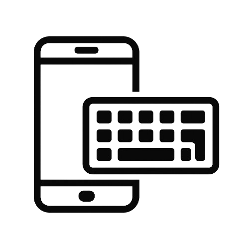
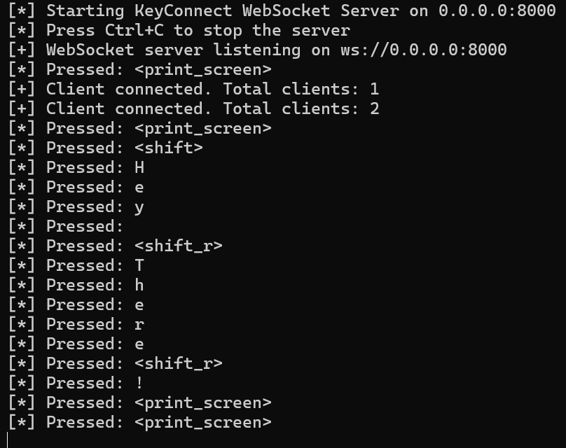
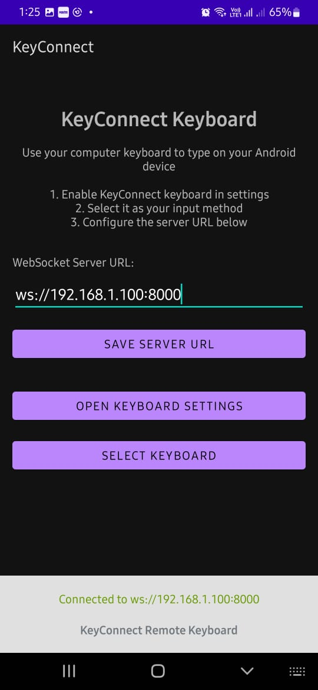
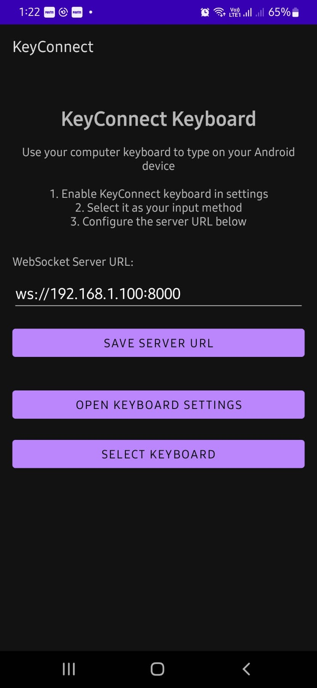

# 📱⚡ Remote Typing App(KeyConnect)

### **Tired of typing long codes on a tiny mobile keyboard? Me too.**

---

## ✨ About the Project

I love coding, but typing tons of backend code on a mobile keyboard inside Termux was... a *pain*.  
(And hey, I'm not a big fan of texting or social media either. I'm more of a keyboard person — real, full-size keyboard!)  
So, seeing this gap, I thought — **"Why not build a solution myself?"**

This project was born from that frustration and love for fast typing.  
Now, I can use my PC's keyboard to type directly into my phone's Termux terminal — no more slow mobile typing! 🚀

---

## 🛠️ Tech Stack

- **Python**: For creating the server using websockets to capture and transmit keystrokes.
- **Java**: To build the Android app that connects to the Python server over the same Wi-Fi network.
- **WebSockets**: For real-time communication between the PC and mobile.

---

## 📦 What's Inside

- ✅ Source code for the Python server
- ✅ Source code for the Android app
- ✅ Ready-to-use APK build
- ✅ Server setup files

---

## 🚀 How It Works

1. **Start the Python server** on your PC/laptop.
2. **Connect the Android app** (built in Java) to the server when both devices are on the **same Wi-Fi**.
3. Start typing on your PC — the keystrokes magically appear on your mobile's Termux terminal!

> **Tip:**  
> Find your PC's IP Address:
> - Windows: `ipconfig`
> - Linux/Mac: `ifconfig`

---

## 📷 Sneak Peek

### Server Running

### Connected Successfully

### Not Connected

---

## 🚧 Future Improvements

- Make it work **vice versa** (maybe control PC typing from mobile? 😉).
- Add **authentication** to make it more secure.
- Improve **UI/UX** of the Android app.
- Add **multi-device** support.

---

## 🤝 Contributing

Got cool ideas? Found bugs? Feel free to contribute and make this project even better!

---

## 📜 License

This project is open source — feel free to use it, learn from it, and improve it!

---

> Made with ❤️ by someone who just loves typing *fast*.
